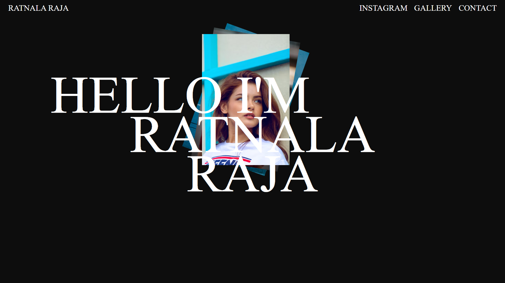

# GSAP Animation Example

This example demonstrates a sequence of animations using GSAP (GreenSock Animation Platform).

## Navigation Header Animation

- Targets all `<h3>` elements within a `.nav` class.
- Animates from 50 pixels above with a fade-in effect.
- Duration: 0.8 seconds.
- Delay: 0.4 seconds.
- Stagger: 0.4 seconds.

## Main Header Animation

- Targets all `<h1>` elements within a `.main` class.
- Animates from 500 pixels to the left with a fade-in effect.
- Duration: 0.8 seconds.
- Stagger: 0.6 seconds.

## Image Animation

- Targets all `` elements.
- Animates from 100 pixels to the right, with a 45-degree rotation and fade-in effect.
- Duration: 0.5 seconds.
- Stagger: 0.5 seconds.

