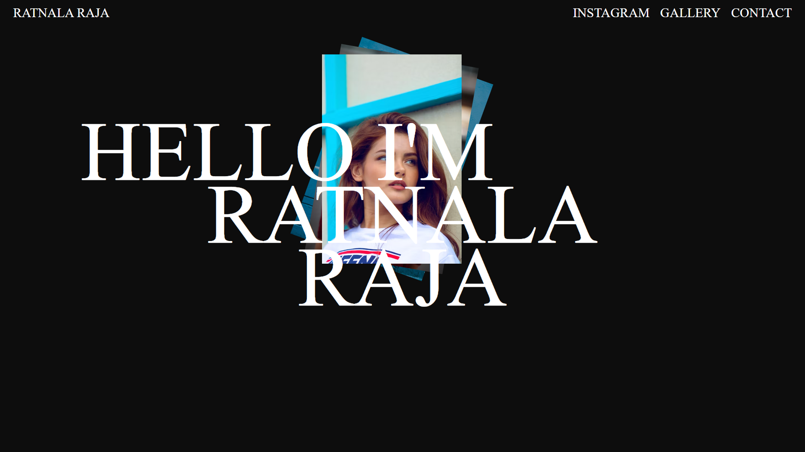

# GSAP Animation Example

This example demonstrates a sequence of animations using GSAP (GreenSock Animation Platform).

## Navigation Header Animation

- Targets all `<h3>` elements within a `.nav` class.
- Animates from 50 pixels above with a fade-in effect.
- Duration: 0.8 seconds.
- Delay: 0.4 seconds.
- Stagger: 0.4 seconds.

## Main Header Animation

- Targets all `<h1>` elements within a `.main` class.
- Animates from 500 pixels to the left with a fade-in effect.
- Duration: 0.8 seconds.
- Stagger: 0.6 seconds.

## Image Animation

- Targets all `` elements.
- Animates from 100 pixels to the right, with a 45-degree rotation and fade-in effect.
- Duration: 0.5 seconds.
- Stagger: 0.5 seconds.

=======================================================================================================================================================
# GSAP Animations with ScrollTrigger

This document provides a description of the GSAP animations applied to elements with the ID `#circle` within different pages (`.page1`, `.page2`, `.page3`). The animations include scaling, rotating, and triggering based on scroll position.

## Animation Description

### Common Properties
All animations share the following properties:
- **Duration**: 2 seconds
- **Scale**: Starts from 0 and scales up to the original size.
- **Rotation**: Rotates 720 degrees.

### Page 1 Animation
- This animation is applied to the `#circle` element within `.page1`.
- The animation starts immediately when the page loads.

### Page 2 Animation with ScrollTrigger Configuration
- This animation is also applied to the `#circle` element within `.page2`.
- **ScrollTrigger Configuration**:
  - **trigger**: Specifies the element that triggers the animation (`.page2 #circle`).
  - **scroller**: Specifies the scrolling container (`body`).
  - **markers**: Adds markers to visualize the start and end points of the trigger (set to `true`).
  - **start**: Defines the start position of the trigger (when the top of the trigger element is at 60% of the viewport height).
  - **end**: Defines the end position of the trigger (when the top of the trigger element is at 30% of the viewport height).
  - **scrub**: Synchronizes the animation with the scroll position (set to 2 seconds).
=============================================================================================================
### **Locomotive Js** 
- [Locomotive JS --For Smooth Scrolling](https://locomotivemtl.github.io/locomotive-scroll/)
- Locomotive Scroll is a JavaScript library that creates smooth scrolling effects on web pages. It enables programmers to produce visual effects where different elements on a page scroll at different rates to give the impression of depth and dimension.
